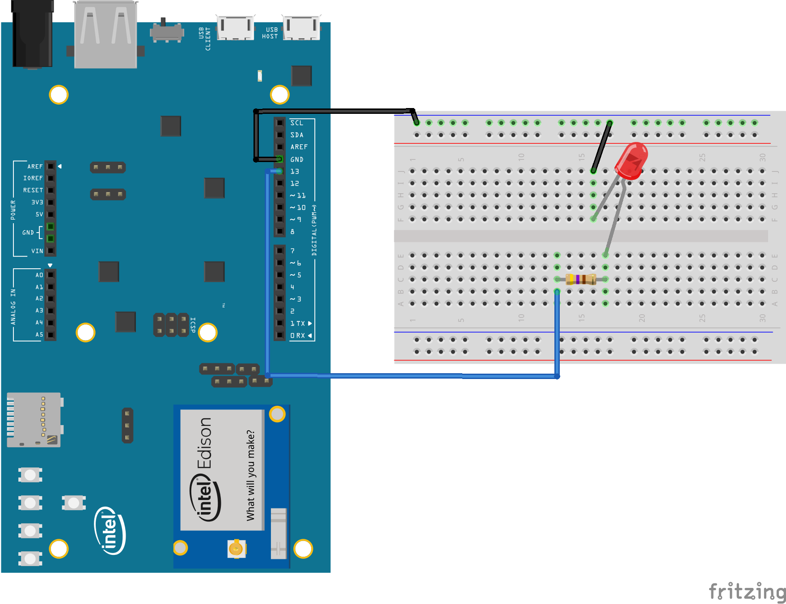
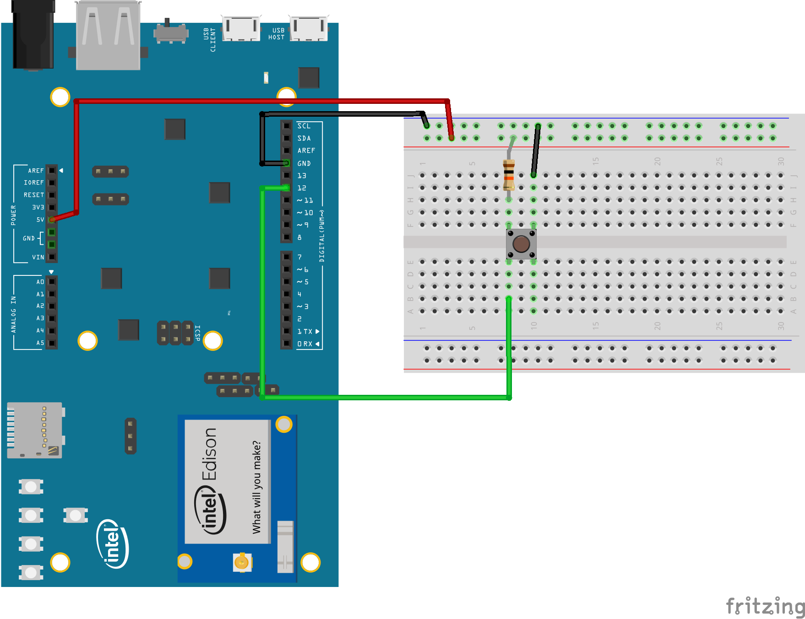
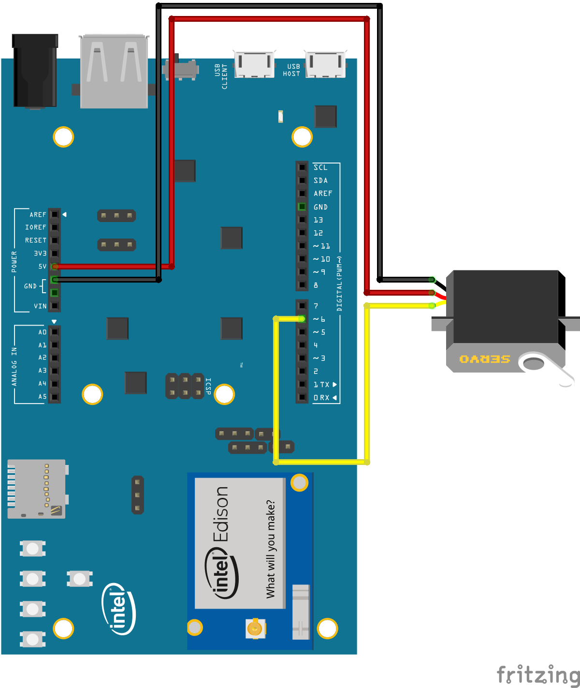
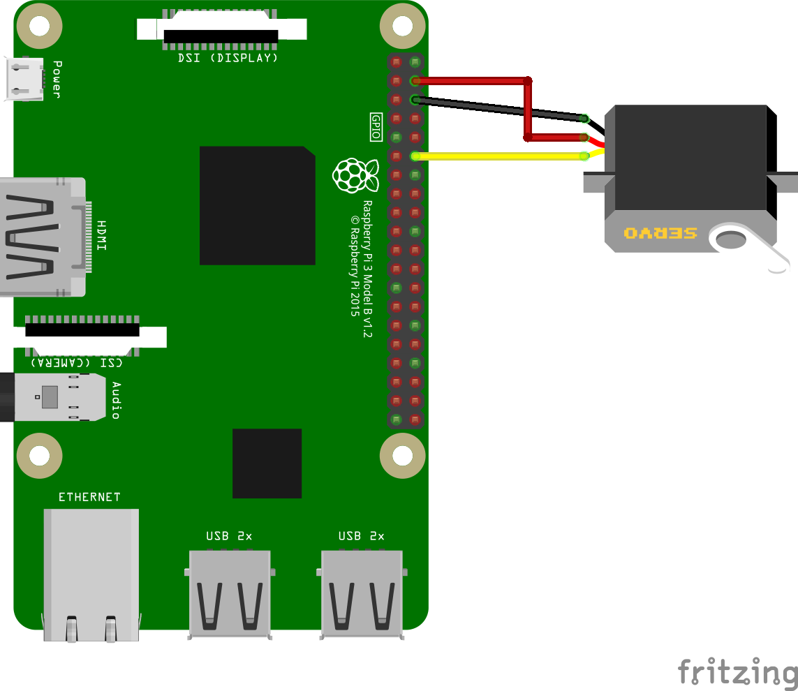

Simple example of Android Things Peripheral I/O APIs
====================================================

This Android Things app runs basic code that exercises the PIO APIs. Each sample is an
Android module that can be run independently.

**IMPORTANT**: Please, note that these samples are not necessarily the easiest way to accomplish
a task. In particular, they handle all low level I/O protocols directly, on
purpose to showcase how to use the Peripheral APIs. In real world applications,
you should use or develop a suitable driver that encapsulates the manipulation
of low level APIs.


Pre-requisites
--------------

- Android Things compatible board
- Android Studio 2.2+

For the Blink sample:
- [Rainbow Hat for Android Things](https://shop.pimoroni.com/products/rainbow-hat-for-android-things) or the following individual components:
    - 1 LED
    - 1 resistor
    - 2 jumper wires
    - 1 breadboard

For the Button sample:
- [Rainbow Hat for Android Things](https://shop.pimoroni.com/products/rainbow-hat-for-android-things) or the following individual components:
    - 1 push button
    - 1 resistor
    - 2 jumper wires
    - 1 breadboard

For the PWM sample:
- 1 servo
- 3 jumper wires
- external power source (recommended, depending on the servo)

Build and install
=================

On Android Studio, select the module in the select box by the "Run" button, and
then click on the "Run" button.

If you prefer to run on the command line, type

```bash
./gradlew <module>:installDebug
adb shell am start com.example.androidthings.simplepio/.<ModuleActivity>
```

Sample Specifics
================

Blink
-----

If you have the Raspberry Pi [Rainbow Hat for Android Things](https://shop.pimoroni.com/products/rainbow-hat-for-android-things), just plug it onto your Raspberry Pi 3.




```bash
    ./gradlew blink:installDebug
    adb shell am start com.example.androidthings.simplepio/.BlinkActivity
```

Blinks an LED connected to a GPIO pin.

Button
------

If you have the Raspberry Pi [Rainbow Hat for Android Things](https://shop.pimoroni.com/products/rainbow-hat-for-android-things), just plug it onto your Raspberry Pi 3.




```bash
    ./gradlew button:installDebug
    adb shell am start com.example.androidthings.simplepio/.ButtonActivity
```

Logs to logcat when a button connected to a GPIO pin is pressed. Make sure you
use a pull-down or pull-up resistor to avoid fluctuation.

PWM
---




```bash
    ./gradlew pwm:installDebug
    adb shell am start com.example.androidthings.simplepio/.PWMActivity
```

Moves a servo from one side to the other on regular steps at a predefined rate.

Servos in general have three wires: Vcc, ground and signal. Connect Vcc to the
board's Vcc or, ideally, to an external power. Ground should go to the board's
ground, and signal goes to the PWM pin specified in the BoardDefaults class. The
most common colors for each wire are red for Vin, gray for ground and orange for
signal, but confirm with your servo's datasheet to be sure.


License
=======

Copyright 2016 The Android Open Source Project, Inc.

Licensed to the Apache Software Foundation (ASF) under one or more contributor
license agreements.  See the NOTICE file distributed with this work for
additional information regarding copyright ownership.  The ASF licenses this
file to you under the Apache License, Version 2.0 (the "License"); you may not
use this file except in compliance with the License.  You may obtain a copy of
the License at

  http://www.apache.org/licenses/LICENSE-2.0

Unless required by applicable law or agreed to in writing, software
distributed under the License is distributed on an "AS IS" BASIS, WITHOUT
WARRANTIES OR CONDITIONS OF ANY KIND, either express or implied.  See the
License for the specific language governing permissions and limitations under
the License.
